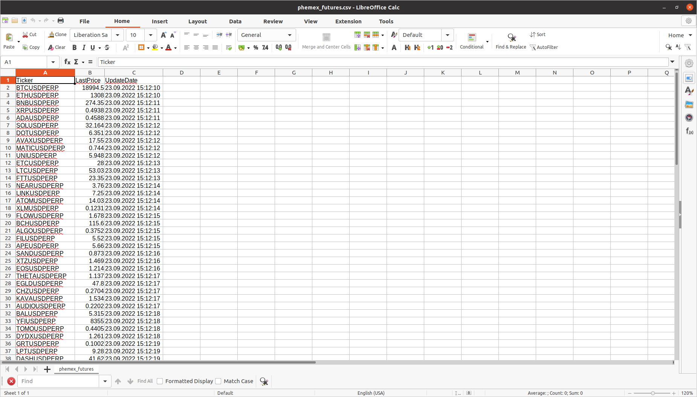

# Crypto price downloader

Application for downloading current cryptocurrencies price from different exchanges.

* Supported exchanges:
  * Phemex
  * Okx
  * Binance
  * Kucoin
  * SimpleFx


## How to build
```bash
./build.sh
```

## How to deploy
```
./deploy.sh ${version}
```

## How to prepare
```bash
./prepare.sh
```

## How to run
```bash
./phemex_futures_price_download.sh
./kucoin_spot_price_download.sh
./binance_spot_price_download.sh
./okx_spot_price_download.sh
./simplefx_cfd_price_download.sh
```

## Technologies
* Python 3
* Pandas
* CCXT
* YFinance

[Release notes](RELEASE_NOTES.md)
